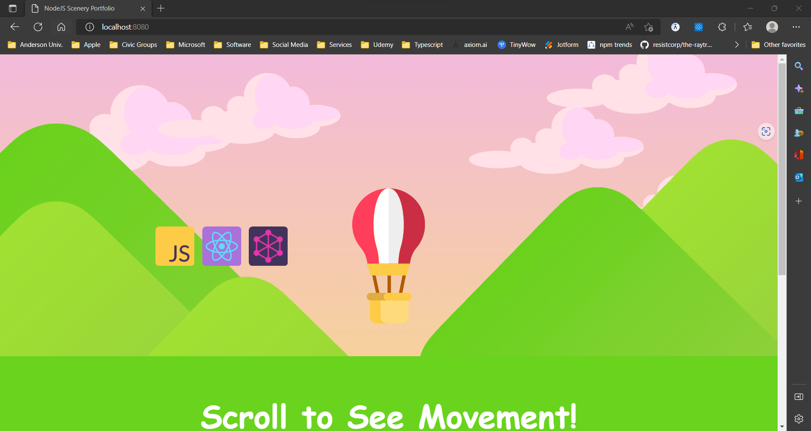

# react-scenery-portfolio

# Scenery

# License
Please see [Apache 2.0 License](./LICENSE) for details

# Works Cited

Kubow, Ania. “Build and Deploy a Responsive Portfolio with Animations in JavaScript (super simple!).” <i>YouTube</i>, YouTube, 6 June 2021, https://www.youtube.com/watch?v=lPRwcWh14nY. Accessed 28 September 2022.